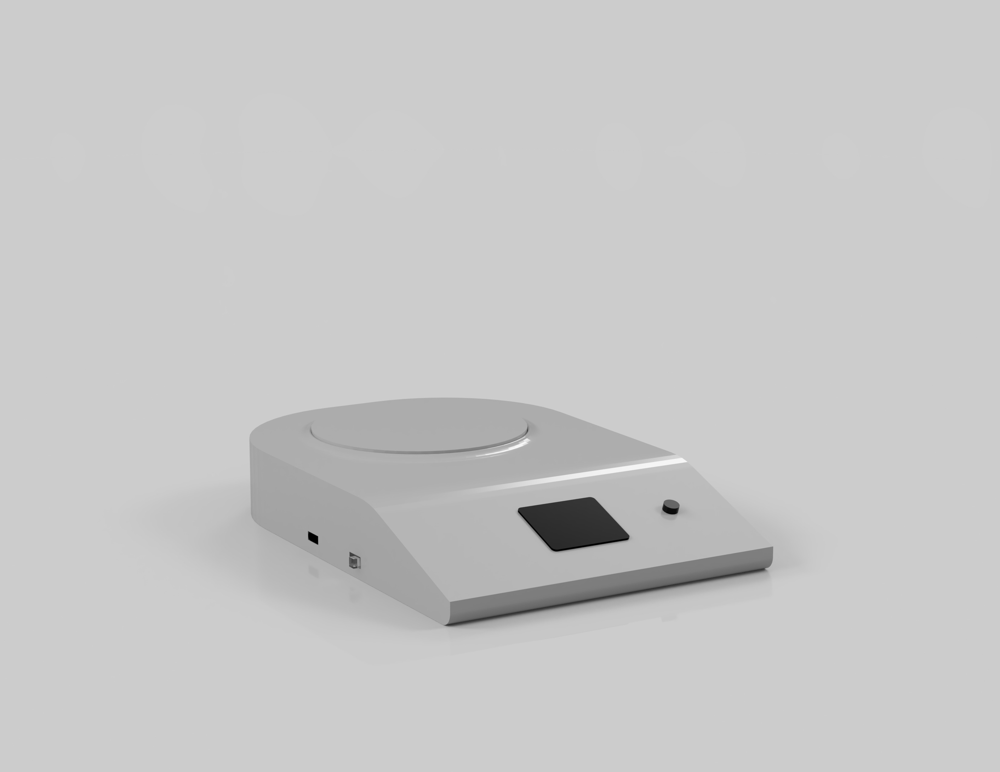

# Smart Gold Scale  

## Description  
The **Smart Gold Scale** is an innovative weighing device designed specifically for gold traders and buyers.  
It connects to the internet via smart devices, allowing real-time gold price calculations based on global market rates.  
The scale features high-precision weight measurement and automatic price updates, ensuring accurate and transparent gold transactions.  
It is ideal for jewelry stores, gold traders, and regulatory bodies.  

## Features  
✔️ High-precision weight measurement  
✔️ Real-time gold price updates  
✔️ Internet connectivity for accurate calculations  

## How It Works  
1️⃣ Power on the Smart Gold Scale.  
2️⃣ Determine thr Carat of the gold item.  
3️⃣ Place the gold item on the scale.                            
4️⃣ The price is automatically calculated.  

## Awards & Recognition  

🏅 **Silver Medal**  
   Seoul International Invention Fair.  

🏆 **Special Awards**  
   - From **UAE**  
   - From **Taiwan**  
   - From **Malaysia**  

